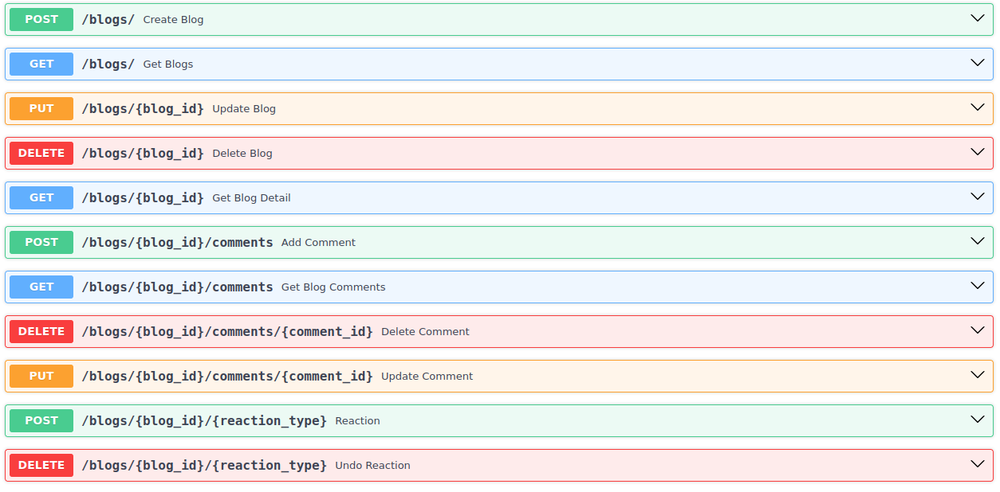

# Blog Platform API
This repository contains the codebase for a RESTful API built with Python using the FASTAPI framework. The API allows users to perform CRUD operations on blog posts, comment on posts, and like/dislike posts. The data is stored in a MongoDB database.

## Requirements
- python
- mongodb installed locally.

## Setup
To get started with the Blog Platform API, follow these steps:
- Clone the repository
    ```bash 
    git clone https://github.com/00AR/blog_app.git
    ```
- Install the dependencies
    ```bash 
    cd blog_app
    python3 -m venv .env
    source .env/bin/activate
    pip install -r requirements.txt
    ```
- MongoDB setup: 
    - Create a file `.env` in app folder
        ```bash
        touch app/.env
        ```
    - Copy and paste these mandatory environment variables that must be entered. **Note:**: Replace the values of these variables with you system specific details. 
        ```
        MONGO_IP="localhost"
        MONGO_PORT="27017"
        MONGO_USER="your mongodb username"
        MONGO_PWD="your mongodb password"
        MONGO_DB=blog_app
        ```
- Run the API server
    ```bash
    uvicorn app.main:app
    ```
- Once the server is running, open your browser and navigate to `http://127.0.0.1:8000/docs#` to explore the API documentation and endpoints interactively.

## Running Tests
- Create a file `.test.env` in `app/` folder of the repository
    ```bash
    touch app/.test.env
    ```
- Add the following environment variables with required values in this file
    ```
    MONGO_IP="localhost"
    MONGO_PORT="27017"
    MONGO_USER="your mongodb username"
    MONGO_PWD="your mongodb password"
    MONGO_DB=test_blog_app
    ```
- In `app/config.py`, find the line `env_file = '.env'` and replace it with this line 
    ```py
    env_file = 'app/.test.env'
    ```
- In terminal with the repository as the current work directory enter the following command
    ```bash
    pytest
    ```
- or run this command: `pytest -s app/tests/api/routes/test_blogs.py`
- **Note:** after running tests, make sure to undo the changes in `app/config.py` for running the app normally. My bad, ran out of time, hence this remained a little hackish :D

## API Details

